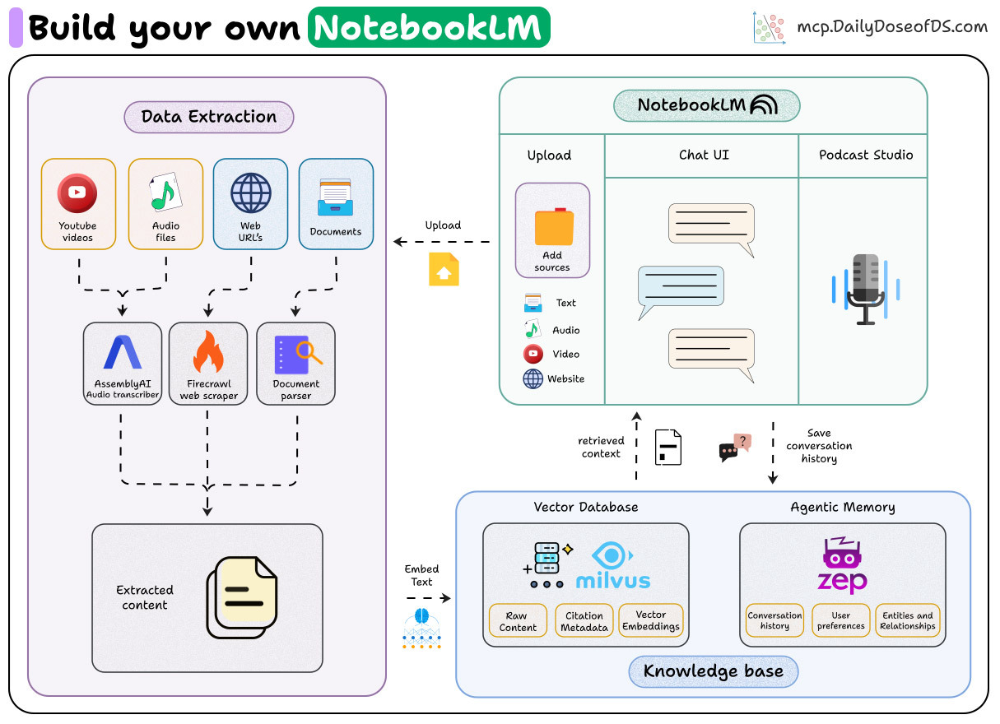
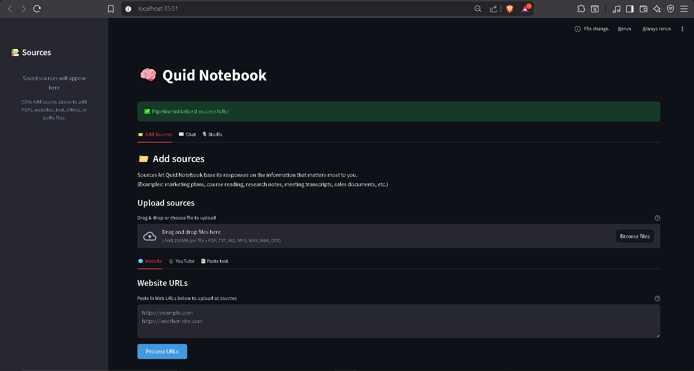

# Quid Notebook

Document-grounded AI assistant that provides cited, verifiable answers from your documents with conversational memory and AI podcast generation.

## Overview

- Upload and process multiple document types (PDF, text, audio, YouTube videos, web pages)
- Ask questions and receive cited, verifiable answers
- Maintain conversational context across sessions
- Generate AI podcasts from your documents
- Clean web interface built with Streamlit

### Tech Stack

- **PyMuPDF** for document parsing (PDF, TXT, Markdown)
- **AssemblyAI** for audio transcription with speaker diarization
- **Firecrawl** for web scraping and content extraction
- **Milvus** vector database for semantic search
- **Zep** temporal knowledge graphs as the memory layer
- **Kokoro** open source Text-to-Speech model
- **Streamlit** for the interactive web UI

### UI

- Three-panel layout: sources panel, chat interface, and studio
- Interactive source citations with metadata in chat responses
- Podcast generation with script creation and multi-speaker TTS

## Architecture



## Data Flow

1. **Ingestion**: User uploads PDF, audio, video, text, or web URL
2. **Processing**: Content extracted with metadata (page numbers, timestamps)
3. **Chunking**: Text split into overlapping segments preserving context
4. **Embedding**: Chunks converted to vector representations
5. **Storage**: Vectors stored in Milvus with citation metadata
6. **Query**: User question embedded and searched semantically
7. **Retrieval**: Top-k relevant chunks retrieved with metadata
8. **Generation**: LLM generates cited response using retrieved context
9. **Memory**: Conversation saved to Zep for future context

## Installation & Setup

**Prerequisites**: Python 3.11+

1. **Install dependencies:**

    ```bash
    # Install uv
    # MacOS/Linux
    curl -LsSf https://astral.sh/uv/install.sh | sh
    # Windows
    powershell -ExecutionPolicy ByPass -c "irm https://astral.sh/uv/install.ps1 | iex"

    # Setup
    uv venv
    source .venv/bin/activate  # MacOS/Linux
    .venv\Scripts\activate     # Windows

    uv sync
    uv add -U yt-dlp
    uv pip install pip
    ```

2. **Set up environment variables:**

   Create a `.env` file:
   ```env
   LLM_PROVIDER=deepseek
   DEEPSEEK_API_KEY=
   GEMINI_API=
   OPENAI_API_KEY=
   ASSEMBLYAI_API_KEY=
   FIRECRAWL_API_KEY=
   ZEP_API_KEY=
   MILVUS_CLOUD_ENDPOINT=
   MILVUS_CLOUD_TOKEN=
   USE_MILVUS_CLOUD=false
   ```

   API key providers:
   - [Assembly AI](https://www.assemblyai.com/)
   - [Zep AI](https://www.getzep.com/)
   - [Firecrawl](https://www.firecrawl.dev/)
   - [OpenAI](https://openai.com)
   - [DeepSeek](https://platform.deepseek.com/)

## Usage

```bash
streamlit run app.py
```

Opens at http://localhost:8501



## Project Structure

```
├── src/
│   ├── audio_processing/
│   │   ├── audio_transcriber.py
│   │   └── youtube_transcriber.py
│   ├── document_processing/
│   │   └── doc_processor.py
│   ├── embeddings/
│   │   └── embedding_generator.py
│   ├── generation/
│   │   └── rag.py
│   ├── llm/
│   │   └── llm_client.py
│   ├── memory/
│   │   └── memory_layer.py
│   ├── podcast/
│   │   ├── script_generator.py
│   │   └── text_to_speech.py
│   ├── vector_database/
│   │   └── milvus_vector_db.py
│   └── web_scraping/
│       └── web_scraper.py
├── tests/
├── data/
├── outputs/
├── assets/
├── app.py
├── manage_collections.py
├── pyproject.toml
└── README.md
```

## Key Features

- **Citation-First**: Every claim backed by specific sources with page numbers and references
- **Memory-Powered**: Temporal knowledge graphs remember context and preferences across sessions
- **Multi-Format**: PDF, text, audio, YouTube videos, and web content
- **AI Podcast Generation**: Transform documents into multi-speaker podcast conversations

